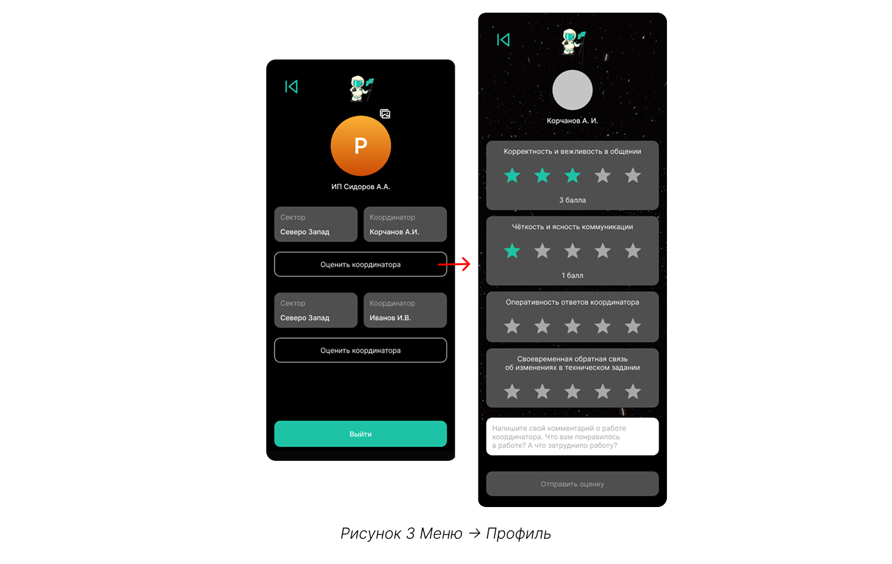
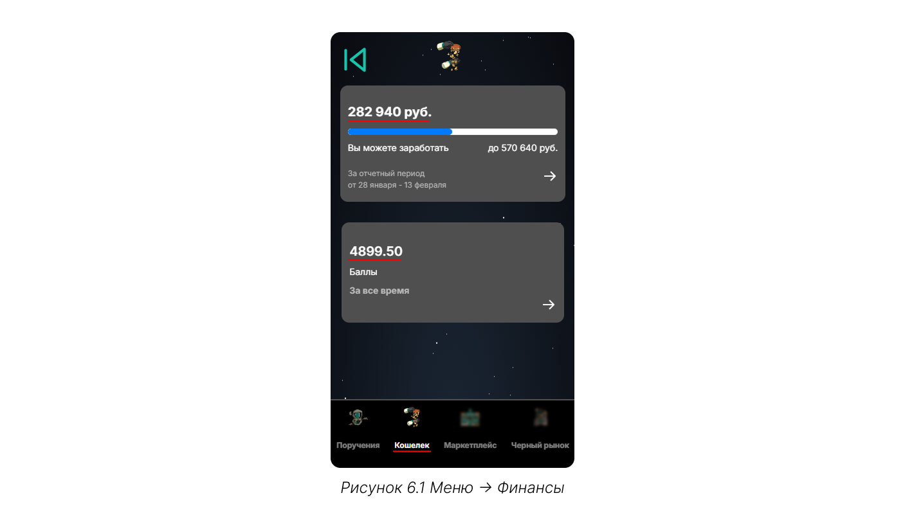
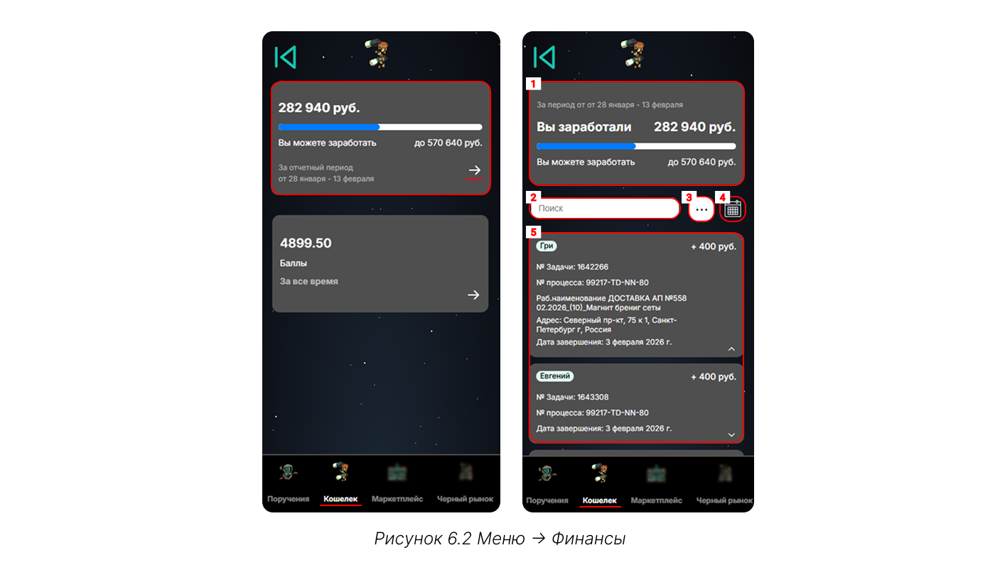
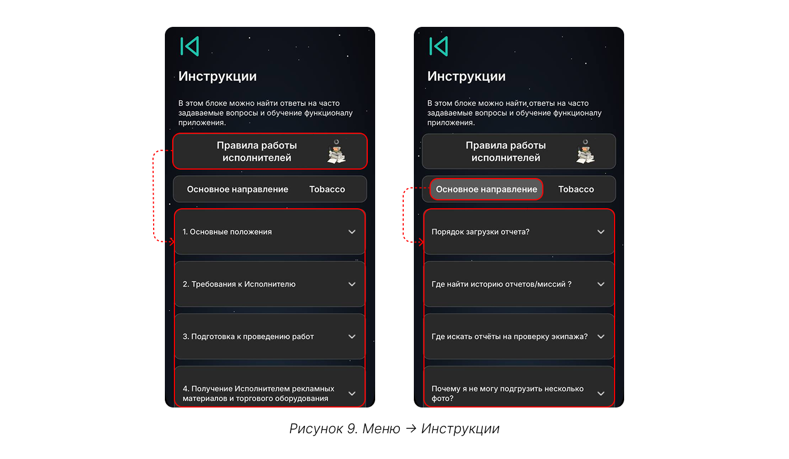

# С чего начать

## Шаг 1. Регистрация

Запустите телеграм-бот @CT_DC_bot по команде «Launch_CT_DT» или /start и введите выданные ранее логин (электронная почта) и пароль. 

{.center width=1200}



Вы можете передавать свои логин и пароль доверенным лицам. Однако, **доступ к системе привязан не только к электронной почте и паролю, но и к профилю телеграм**, из которого выполняется вход. Это означает, что если несколько человек используют одни и те же [учётные данные](*key_data), система будет распозновать их как разных пользователей — по их телеграм-аккаунту.



Право подтвердить статус главного контрагента предоставляется только первому пользователю, выполнившему вход с выданными учётными данными: все последующие пользователи, использующие те же логин и пароль, автоматически получают статус второстепенных. 

Для разных пользователей в личном кабинете доступен индивидуальный чат с технической поддержкой: **запросы и переписка одного пользователя не видны другому.** 

Также только главный контрагент может выставлять оценки координаторам за отчётный период — вся остальная функциональность платформы (работа с заказами, отчётами, командой) остаётся полностью доступна всем пользователям.

## Шаг 2. Знакомство с интерфейсом

На главной странице доступно четыре команды:
1. [экипаж](./work_with_team.md "Экипаж") — добавление членов экипажа и управление командой;
2. [результат миссий](./mission "Миссии") хранит историю выполненных заявок или миссий, а также отчеты, которые находятся на проверке или отклонены;
3. [загрузка отчёта](./report "Загрузка отчёта") — фиксация результата миссии;
4. меню — содержит дополнительные разделы, описанные ниже.

{.center width=1200}

## Шаг 3. Меню

### 3.1. Профиль 

14 и 29 числа, после завершения отчетного периода, на вкладке «Профиль» для главного пользователя появляется возможность оценить работу с координаторами и оставить оценки по нескольким параметрам.  

{.center width=1200}

Также все пользователи могут установить фото и выйти из профиля. 

### 3.2. Дорожная карта 

Интерактивная дорожная карта знакомит с историей развития компании и планами по развитию MiniApp. На странице отражены ключевые этапы пути и стратегия на будущее.

{.center width=1200}

Чтобы вернуться на главный экран, нажмите на стрелку «Назад» в левом верхнем углу.

### 3.3. Рейтинг

На вкладке размещается сводный отчёт, который формируется на основе метрик по всем выполненным заказам. За выполнение каждой метрики назначаются баллы. Сумма баллов определяет ваше место в рейтинге. Можно посмотреть свое место в компании (среди всех контрагентов), так и в секторе, к которому относится территория (например, Восточная Сибирь или Дальний Восток).

{.center width=1200}

Учитывается восемь метрик:
1. **качество сроков** — отражает, насколько своевременно задачи выполняются в соответствии с дедлайнами: чем точнее соблюдены сроки, тем выше ваш результат в сравнении с другими контрагентами;
2. **скорость завершения проектов** — отражает, насколько быстро задачи закрываются с момента их старта в сравнении с другими контрагентами;
3. **внедрение** — оценивает, насколько активно вы используете наш MiniApp для загрузки отчетов в сравнении с другими контрагентами;
4. **эффективность сроков** — показатель качества выполнения задач, учитывающий количество дней опозданий в сравнении с другими контрагентами;
5. **динамика выполнения** — показатель, как быстро вы можете выполнять задачи в сравнении с другими контрагентами;
6. **объем задач** — показатель того, насколько много задач вы выполняете в сравнении с другими контрагентами: чем больше выполнено задач, тем выше ваша оценка;
7. **отклонения отчетов** — показатель, какой процент задач был отклонен по всем выполненным работам в сравнении с другими контрагентами; 
8. **экономическая результативность** — отражает, насколько эффективным и ценным является ваше сотрудничество с нами с точки зрения соотношения затрат и полученных результатов в сравнении с другими контрагентами. 

Отдельный график динамики результата показывает, как изменились ваши результаты по всем метрикам за месяц/полгода/год, и указывает на точки роста.

{.center width=1200}

В качестве ориентира для роста используйте показатели других контрагентов. В рейтинге отображается Топ-5 контрагентов с указанием места и баллов, а также список аутсайдеров с худшими результатами.

{.center width=1200}

### 3.4. Финансы

На вкладке «Финансы» расположены «Поручения», «Кошелек», «Маркетплейс» и «Чёрный рынок».
Вкладки «Маркетплейс» и «Чёрный рынок» находятся в разработке, основная работа — на вкладках «Кошелек» и «Поручения».



- Кошелек

    Здесь отражены результаты в денежном эквиваленте: сколько уже заработали, какой доход ожидается, и сколько баллов получено за выполненные заказы в этом периоде.

    {.center width=1200}

    При клике на карточку с деньгами отражаются следующие элементы:

    {.center width=1200}

    1. **Шкала прогресса** с фактическим заработком — сумма по всем выполненным заказам, и с потенциальным заработком — сумма, по заказам, запланированным на вас в текущем отчетном периоде;
    2. **Поисковая строка** позволяет найти задачу по номеру или имени исполнителя;
    3. **Команда «...»** разворачивает и сворачивает информацию по всем задачам;
    4. **Календарь** позволяет отфильтровать задачи по срокам, однако, задачи вне отчетного периода не будут отражены; 
    5. **Список задач** содержит все задания отчётного периода. Чтобы просмотреть детали конкретной задачи (рабочее наименование и адрес выполнения), нажмите на карточку этой задачи.

- Поручение

статусы: оплачено, ожидает отчетной документации, новое

Когда распределяется новое поручение оно появляется со статусом новое: можно познакомиться с документами, скачав zip архив. 
С документами необходимо ознакомиться, распечатать и подписать.
Отправить с курьером.
После того, как курьер забрал документы, необходимо выбрать поручение и подтвердить отправку.
Статус поменяется на ожидает отчетной документации.
Когда курьер доставит и менеджеры примут, в планировании появятся задачи, которые необходимо выполнить в рамках поручения. 
Далее исполнители предоставляют отчеты о выполненных заданиях и получают выплаты. 
Как только все задания выполнены, поручение меняет статус на оплачено.

поиск и календарь для фильтрации.



### 3.5. Планирование

Список задач, которые необходимо выполнить в рамках подписанного поручения. 

При клике на задачу открывается карточка задачи.

Можно скачать техническое задание и ознакомиться с тем, что необходимо сделать.

Задачи группируются по маршрутам, на каждый маршрут можно назначить разных исполнителей.
Есть фильтры: можно отобразить маршруты, которые выполняете вы, а которые выолняют команды. 

При клике по мрашруту будет открыта карточка с задачей, где будет указаны номер задачи, наименование (что нужно сделать), адрес, также по каждой задаче указывается контактный номер, по которому можно позвонить. назначить экипаж можно по команде карандаша и выбрать исполнителей. 

Также сам маршрут можно посмотреть на карте. 

### 3.6. Техподдержка

При возникновении ошибок в работе платформы обратитесь в техподдержку. 
У каждого пользователя личная история сообщений, которую не видят другие.

{.center width=1200}

### 3.7. Инструкции

Часто возникающие вопросы собраны на вкладке «Инструкции». 

{.center width=1200}

«Правила работы исполнителей» содержат все требования к:
- исполнителю;
- подготовке до начала выполнения работ;
- проведению работ;
- доставке, передаче и хранении оборудования;
- отчётам, предоставляемым после проведения работ.

В «Основном направлении» описаны часто задаваемые вопросы, связанные с функционалом и логикой работы MiniApp, вкладка «Tobacco» не используется. 

### 3.8. Telegram канал

[Telegram-канал ПОСМ.РЦ](https://t.me/+-lx6zwwgbqpiNzcy) с новостями, анонсами и обновлениями.  

## Шаг 4. Работа после

[*key_data]: Учётные данные — логин (электронная почта или email) и пароль.