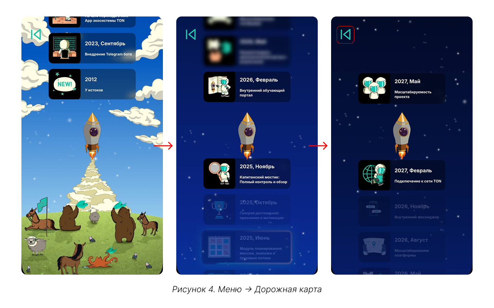
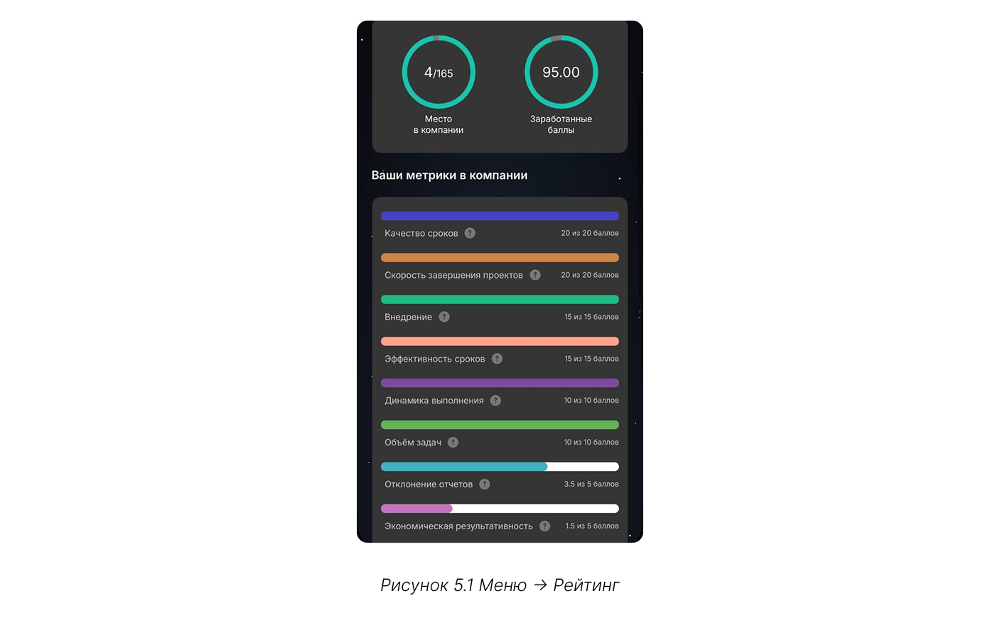
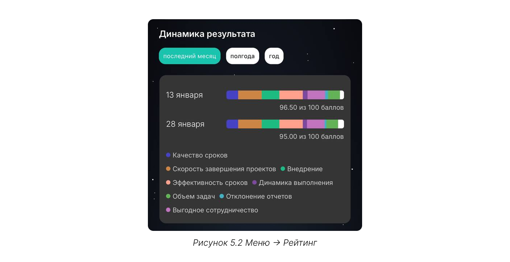
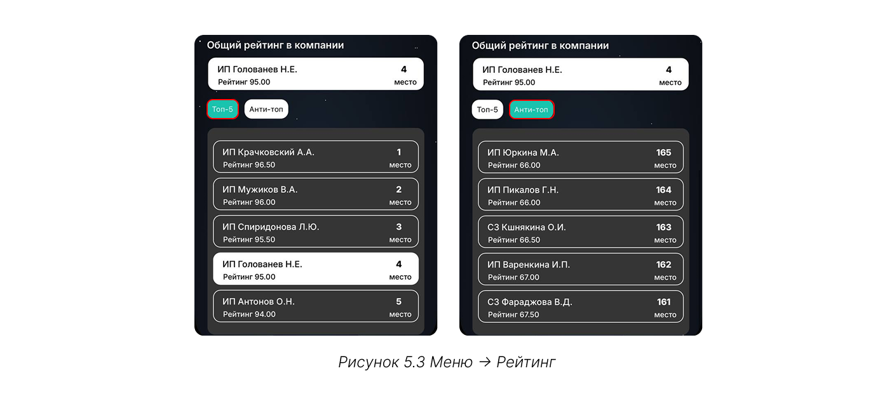
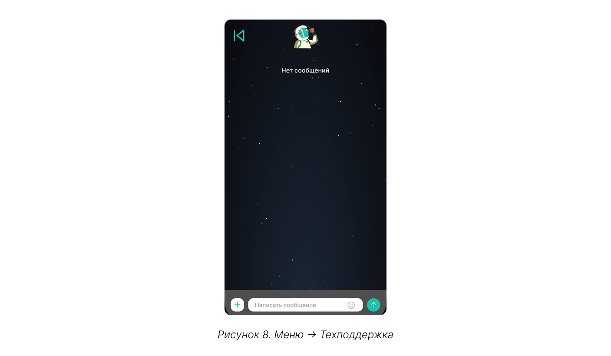

# С чего начать

## Шаг 1. Регистрация

Запустите телеграм-бот @CT_DC_bot по команде «Launch_CT_DT» или /start и введите выданные ранее логин (электронная почта) и пароль. 

{.center width=1200}



**Доступ к системе привязан не только к электронной почте и паролю, но и к профилю телеграм**, из которого вы входите. 

Таким образом, если несколько человек используют одни и те же логин и пароль, система распознает каждого как отдельного пользователя — по их телеграм-аккаунту.

Для разных пользователей в личном кабинете доступен индивидуальный чат с технической поддержкой: запросы и переписка одного пользователя не видны другому. 



## Шаг 2. Знакомство с интерфейсом

После входа будет открыта главная страница, где активно 4 команды:
1. [экипаж](./work_with_team.md) — добавление членов экипажа и работа с командой;
2. [результат миссий](./mission.md) хранит историю выполненных заявок или миссий, а также те отчеты, которые находятся на проверке или отклонены;
3. [загрузка отчёта](./report.md) — фиксация результата миссии;
4. меню — вкладки описаны ниже. 

{.center width=1200}

## Шаг 3. Меню

### 3.1. Профиль 

### 3.2. Дорожная карта 

Интерактивная дорожная карта знакомит с историей развития компании и планами по развитию MiniApp. На странице отражены ключевые этапы пути и стратегия на будущее.

{.center width=1200}

Чтобы вернуться на главный экран, нажмите на стрелку «Назад» в левом верхнем углу.

### 3.3. Рейтинг

На вкладке размещается сводный отчёт, который формируется на основе метрик по всем выполненным заказам. Рейтинг учитывает результаты работы как вас лично, так и ваших подчинённых — членов экипажа. За выполнение каждой метрики назначаются баллы и сумма баллов определяет ваше место в рейтинге. Можно посмотреть свое место в компании (среди всех контрагентов), так и в секторе, к которому относится территория (например, Восточная Сибирь или Дальний Восток).

{.center width=1200}

Учитывается восемь метрик:
1. **качество сроков** — отражает, насколько своевременно задачи выполняются в соответствии с дедлайнами: чем точнее соблюдены сроки, тем выше ваш результат в сравнении с другими контрагентами;
2. **скорость завершения проектов** — отражает, насколько быстро задачи закрываются с момента их старта в сравнении с другими контрагентами;
3. **внедрение** — оценивает, насколько активно вы используете наш MiniApp для загрузки отчетов в сравнении с другими контрагентами;
4. **эффективность сроков** — показатель качества выполнения задач, учитывающий количество дней опозданий в сравнении с другими контрагентами;
5. **динамика выполнения** — показатель, как быстро вы можете выполнять задачи в сравнении с другими контрагентами;
6. **объем задач** — показатель того, насколько много задач вы выполняете в сравнении с другими контрагентами: чем больше выполнено задач, тем выше ваша оценка;
7. **отклонения отчетов** — показатель, какой процент задач был отклонен по всем выполненным работам в сравнении с другими контрагентами; 
8. **экономическая результативность** — отражает, насколько эффективным и ценным является ваше сотрудничество с нами с точки зрения соотношения затрат и полученных результатов в сравнении с другими контрагентами. 

Отдельный график динамики результата показывает, как изменились ваши результаты по всем метрикам за месяц/полгода/год, и указывает на точки роста.

{.center width=1200}

В качестве ориентира для роста используйте показатели других контрагентов. В рейтинге отображается Топ-5 контрагентов с указанием места и баллов, а также список аутсайдеров с худшими результатами.

{.center width=1200}

### 3.4. Финансы

### 3.5. Планирование

### 3.6. Техподдержка

При возникновении ошибок в работе платформы обратитесь в техподдержку. У каждого пользователя личная история сообщений, которую не видят другие.

{.center width=1200}

### 3.7. Инструкции

### 3.8. Telegram канал

Telegram-канал пока находится в разработке. 